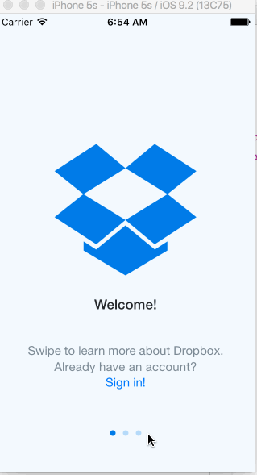

# AB_HW_Week1_v4
This is a Dropbox prototype

Time spent: 9 hours spent in total

Completed user stories:

 * [x] User can tap through the 3 welcome screens. Plus, this version includes the scroll by page.
 * [x] User can follow the create user flow.
 * [x] On the create user form, the user can tap the back button to go to the page where they can sign in or create an account.
 * [x] Before creating the account, user can choose to read the terms of service.
 * [x] After creating the account, user can view the placeholders for Files, Photos, and Favorites as well as the Settings screen.
 * [x] User can log out from the Settings screen.
 * [x] User can follow the sign in flow. 
 * [x] User can tap the area for "Having trouble signing in?"
 * [x] User can log out from the Settings screen.
 
Notes:

Walkthrough of all user stories:

GIF created with [LiceCap](http://www.cockos.com/licecap/).
